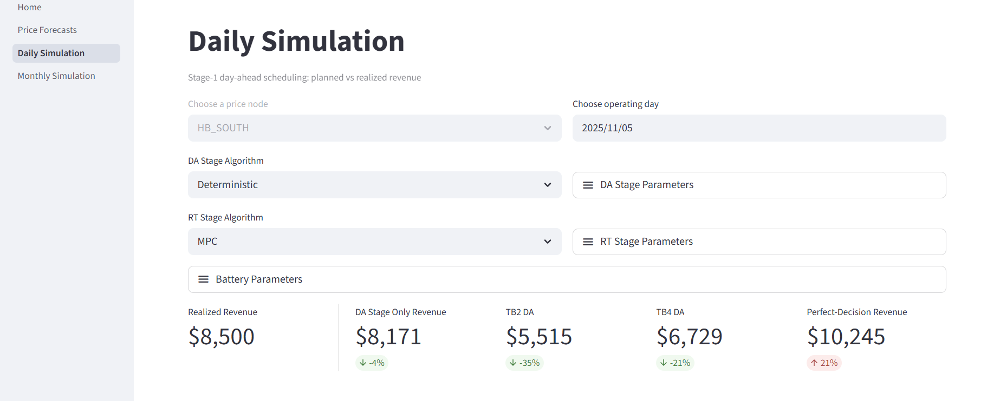
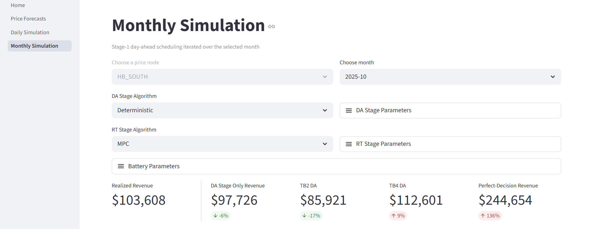
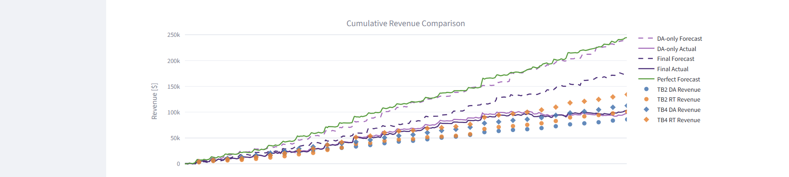
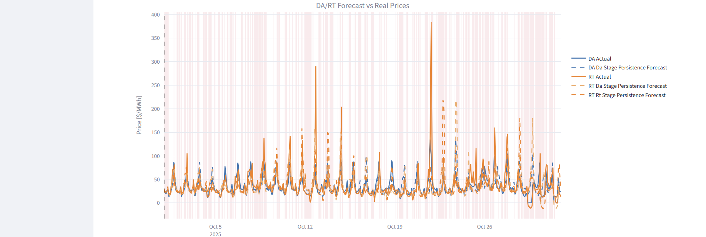

# MPC-BESS-ERCOT

A 2-stage MPC controller producing bidding strategy and battery control for Day-Ahead and Real-Time Energy and Ancillary Services ERCOT markets.

## Overview

This project implements a two-stage optimization framework for battery energy storage systems (BESS) participating in ERCOT electricity markets:

1. **Stage 1 (Day-Ahead Scheduling)**: Solves a convex optimization problem once per day to determine optimal day-ahead bids and provisional real-time energy bids
2. **Stage 2 (Real-Time MPC)**: Runs every 15 minutes using model predictive control to adjust RT bids based on updated forecasts

## Installation

This project uses `uv` for fast, reliable Python package management. If you don't have it installed:

```bash
# Install uv (macOS/Linux)
curl -LsSf https://astral.sh/uv/install.sh | sh

# Or using pip
pip install uv
```

Install dependencies:

```bash
uv sync
```

## Data Setup

The simulator requires three CSV files in the `data/` directory:

- `All_2020_2024_with_AS.csv` - Day-ahead market training data
- `All_2025_with_AS.csv` - Day-ahead market testing data
- `RTM_all_2020_2025_enriched.csv` - Real-time market data

3-months sample files are provided for quick testing. Reach out to authors for access to the full datasets.

## Running Simulations

### Basic Usage

Run a monthly simulation and create results plot:

```bash
uv run main.py
```

## Running The Streamlit App

Start the multipage dashboard:

```bash
uv run streamlit run app/Home.py
```

Screenshot of daily performance analysis page:


Screenshots of the app monthly performance analysis page:





## Optimization Formulation

This version of the formulation focuses only on the DA and RT energy markets. Ancillary services and other market products can be added in future iterations.

### Day Ahead Stage

#### Decision Variables

| *Notation* | *Description* | *Units* |
| ---------- | ------------- | ------- |
| $p_{da}(t)$ | Day-ahead power bid, $t \in \{0, \ldots, T-1\}$ | [MW] |
| $p_{rt}(t)$ | Real-time power bid, $t \in \{0, \ldots, T-1\}$ | [MW] |
| $p_{real}(t)$ | Actual net power delivered, $t \in \{0, \ldots, T-1\}$ | [MW] |
| $p_{dis}(t)$ | Net discharge power, $t \in \{0, \ldots, T-1\}$ | [MW] |
| $p_{ch}(t)$ | Net charge power, $t \in \{0, \ldots, T-1\}$ | [MW] |
| $E(t)$ | Energy stored in the battery,  $t \in \{0, \ldots, T\}$ | [MWh] |

*Note: $p_{da}(t)$ and $p_{rt}(t)$ can be positive (buying/charging) or negative (selling/discharging)*

#### Parameters

| *Notation* | *Description* | *Units* |
| ---------- | ------------- | ------- |
| $T$ | Final time step of the optimization horizon | [.] |
| $\Delta t$ | Time step duration (e.g., 0.25 for 15 minutes) | [hours] |
| $c_{da}(t)$ | Day-ahead price, $t \in \{0, \ldots, T-1\}$ | [$/MWh] |
| $c_{rt}(t)$ | Real-time price, $t \in \{0, \ldots, T-1\}$ | [$/MWh] |
| $\eta_{ch}$ | Charging efficiency (between 0 and 1) | [.] |
| $\eta_{dis}$ | Discharging efficiency (between 0 and 1) | [.] |
| $E_{\min}$ | Minimum energy level | [MWh] |
| $E_{\max}$ | Maximum energy level | [MWh] |
| $E_0$ | Initial and terminal energy level at $t=0$ and $t=T$ | [MWh] |
| $P_{\max}$ | Maximum charge/discharge power | [MW] |
| $\delta_{cycle}$ | Max number of battery cycles per day | [.] |

#### Objective

Minimize costs (maximize profits), which is costs from day-ahead and real-time markets:

```math
\begin{align}
\min_{\text{decision variables}} \quad & \sum_{t=0}^{T-1} \left( c_{da}(t) p_{da}(t) + c_{rt}(t) p_{rt}(t) \right) \Delta t

\end{align}
```

#### Constraints

```math
\begin{align}

\text{Net Power flow:}
&& p_{real}(t) &= p_{da}(t) + p_{rt}(t)
&& \forall t \in \{0, \ldots, T-1\} \\

\text{Net power decomposition:}
&& p_{real}(t) &= p_{ch}(t) - p_{dis}(t)
&& \forall t \in \{0, \ldots, T-1\} \\

\text{Charge/discharge limits:}
&& 0 &\leq p_{ch}(t) \leq P_{\max}
&& \forall t \in \{0, \ldots, T-1\} \\
&& 0 &\leq p_{dis}(t) \leq P_{\max}
&& \forall t \in \{0, \ldots, T-1\} \\

\text{Market bids power limits:}
&& -P_{\max} &\leq p_{da}(t) \leq P_{\max}
&& \forall t \in \{0, \ldots, T-1\} \\
&& -P_{\max} &\leq p_{rt}(t) \leq P_{\max}
&& \forall t \in \{0, \ldots, T-1\} \\

\text{Energy dynamics:}
&& E(t+1) &= E(t) + \eta_{ch} p_{ch}(t) \Delta t - \frac{p_{dis}(t)}{\eta_{dis}} \Delta t
&& \forall t \in \{0, \ldots, T-1\} \\

\text{Energy limits:}
&& E_{\min} &\leq E(t) \leq E_{\max}
&& \forall t \in \{0, \ldots, T\} \\

\text{Energy bounds at start and end:}
&& E(0) &= E_0  \\
&& E(T) &= E_0 \\

\text{Battery cycling limit (prevents excessive cycling):}
&& \sum_{t=0}^{T-1} p_{ch}(t) \Delta t &\leq \delta_{cycle} (E_{\max} - E_{\min}) \\

\end{align}
```

### Real-Time Stage (MPC)

The MPC stage solves the same optimization problem, except that the day ahead bids $p_{da}(t)$ are fixed to the values determined in the day-ahead stage. The optimization is solved at every time step $t$ with a receding horizon, using updated forecasts for prices and system states. Only the first output of each optimization is implemented, and the process repeats at the next time step.

Even when using a persistence forecast, this controller allows improving the trading performance up to 10% compared to a static day-ahead schedule.

## Forecasting Methods

This project is not focused on forecasting, its goal is to improve the performance of the trading algorithms. Therefore, the main forecasting method studed is a simple persistence forecast, which assumes that future values will be the same as the most recent observed value. This is a common baseline in energy forecasting and provides a useful benchmark for evaluating the benefits of the MPC controller.

That being said, we also provide very basic autoregressive forecasts using linear regression and XGBoost, which can be used to test the controller performance with more sophisticated forecasts. The forecasting module is designed to be modular, so that more advanced forecasting methods (e.g., LSTM, Transformer, Prophet, etc.) can be easily integrated in the future.

## Architecture

### Modules

- [main.py](main.py) - CLI entrypoint for month-level simulation and PNG export
- [src/stage1_da_scheduler.py](src/stage1_da_scheduler.py) - Day-ahead stage optimization (CVXPY)
- [src/stage2_rt_mpc.py](src/stage2_rt_mpc.py) - Real-time stage MPC optimizer (CVXPY)
- [src/one_day_simulation.py](src/one_day_simulation.py) - Core two-stage daily simulation workflow
- [src/multi_day_simulation.py](src/multi_day_simulation.py) - Day-range orchestration built from repeated one-day runs
- [src/forecasts/forecaster.py](src/forecasts/forecaster.py) - Forecast generation (persistence, perfect, regression, xgboost)
- [src/utils/] - Utility functions for data loading, performance metrics, etc.
- [app/] - Streamlit app for interactive performance analysis

## License

See LICENSE file for details.
